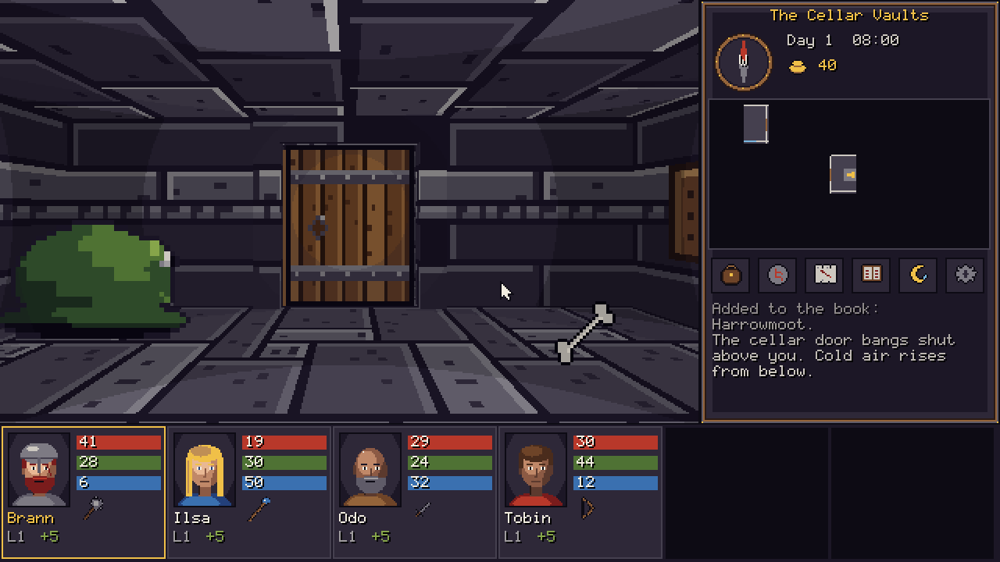
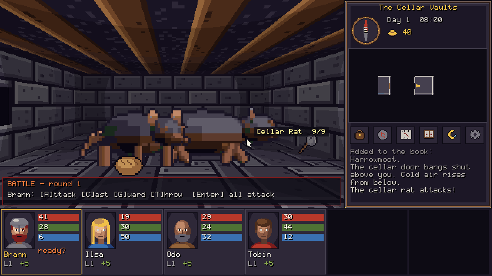
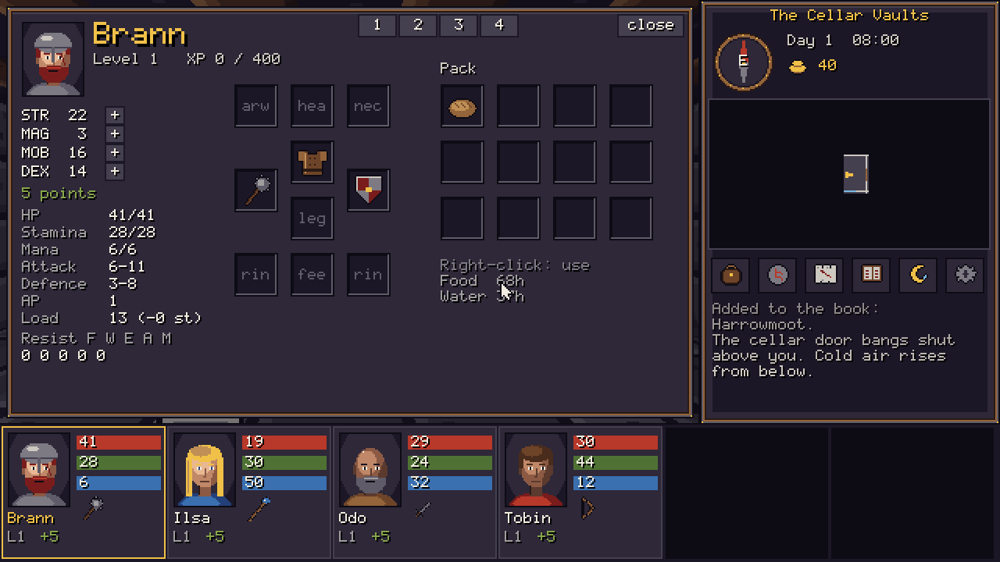
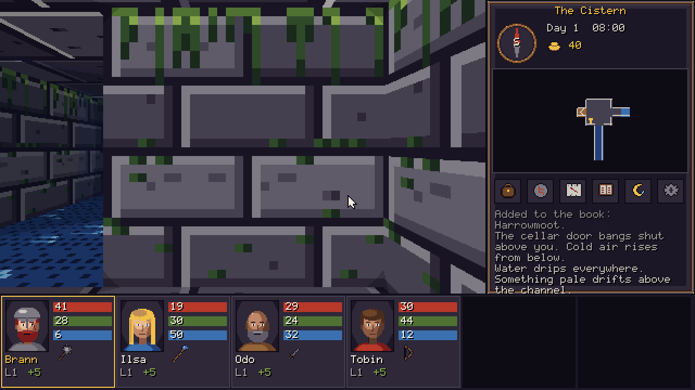
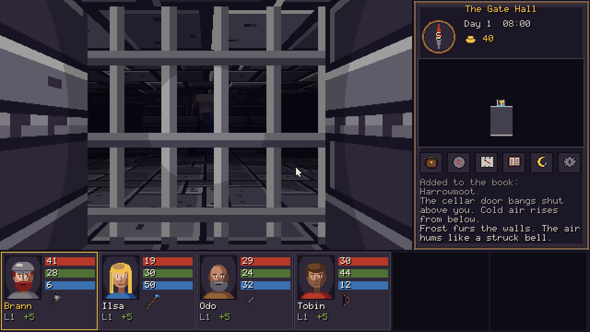

# Gates Below

*Gates Below* is a first-person, step-by-step party dungeon crawler. It is built on the mechanics of **Gates of Skeldal** (*Brány Skeldalu*, 1998), which were reverse-engineered from that game's C source.

You lead four townsfolk of Harrowmoot down three levels of the Underkeep, to bring back the stolen Sealstone and set it in the Nether Gate.



| | |
|---|---|
|  |  |
|  |  |

**What is from the original, and what is new.**
- **From the original:** the rules. The hit formula, action points, casting risk, XP table, square/face level model and monster AI order all follow the source. See **[docs/ANALYSIS.md](docs/ANALYSIS.md)** for how the original works.
- **New:** everything you see and hear. The world, story, characters, text, maps, art, sound and music are all original to this project. The source release contains no game data, and none is used.
- **[docs/DESIGN.md](docs/DESIGN.md)** lists what was kept, adapted and dropped, and holds the walkthrough (spoilers).

## Built with

| tool | role |
|---|---|
| **Godot 4.7** (Compatibility renderer) | the game. It has a pure-GDScript rules core (`godot/scripts/core`) that also runs headless for the tests, and a 3D grid view with pixel textures, torchlight and banded distance fog (`godot/scripts/view`) |
| **Blender** (4.5 LTS, run as the `bpy` module) | the monster and NPC sprites (modelled from primitives, rendered orthographically at 25 px/m) and the level kit (stairs down, stairs up and a door arch, exported as GLB) |
| **Aseprite** file format | every texture, item icon, portrait, UI piece and cleaned-up monster sheet is an editable `.aseprite` source in `art/aseprite/`. The game's PNGs are exported **from those files** |

The Aseprite, Blender and Godot MCP servers were not connected in the session that built this. The pipeline therefore drives the same tools through their own interfaces:
- **Aseprite:** `pipeline/aseprite/asefile.py` reads and writes the documented `.aseprite` format. An independent parser (`ase-parser`) reads its output back identically, and `tests/verify_art.py` checks every exported pixel against its source.
- **Blender:** `bpy`.
- **Godot:** the headless editor.

See [docs/PIPELINE.md](docs/PIPELINE.md).

## Play

| build | how |
|---|---|
| Godot editor | open `godot/project.godot` in Godot 4.7 and press F5 |
| Linux / Windows | `godot --headless --path godot --export-release "Linux" ../dist/linux/gates-below.x86_64` (or `"Windows Desktop"` and `../dist/windows/gates-below.exe`). This writes one self-contained file. It needs the 4.7.1 export templates |

**Controls**

| key | action |
|---|---|
| W / ↑, S / ↓ | step forward / back |
| A, D | strafe |
| Q / ←, E / → | turn |
| Space | use the wall ahead (lever, door, keyhole, niche, fountain) |
| mouse | click walls, floor items and people in the view. An item you pick up rides on the cursor; click a portrait to stow it |
| I or 1-6 | inventory |
| C | cast (rune picker) |
| M / Tab | map |
| B | book |
| R | rest |
| F5 / F9 | quick save / quick load |
| Esc | menu (10 save slots; slot 9 is the autosave made on every level change) |

**In battle** each character plans an action:

| key | action |
|---|---|
| A | attack |
| C | cast |
| G | guard |
| T | throw the held item |
| Enter | everyone attacks |

Then all the actions play out in a random order. A movement key moves the whole party instead. Blows only reach the square straight ahead, so face your enemy.

## Layout

```
docs/          ANALYSIS.md (how Skeldal works), DESIGN.md (the remake, spoilers), PIPELINE.md, screens/
godot/         the Godot 4.7 project
  scripts/core rules.gd, level.gd, game.gd, battle.gd, magic.gd, rng.gd, content.gd  (no nodes)
  scripts/view main.gd, dungeon.gd (3D), ui.gd (2D), audio.gd, assets.gd, pixfont.gd
  shaders/     world.gdshader (torchlight bands + fog, used by every surface and sprite)
  content/     the content package, loaded raw at runtime: data/*.json, levels/*.json,
               textures, items, portraits, ui, sprites (PNG + JSON), models (GLB), sfx, music
  tests/       run_tests.gd (unit + lint + save + full playthrough), bot.gd, walkthrough.gd, balance.gd
pipeline/      aseprite/ (asefile.py, art_*.py, build/export/import), blender/ (kit, sprites, props), audio/
art/           aseprite/*.aseprite and blender/*.blend: the editable sources
tests/         run_all.sh, verify_art.py, verify_audio.py, mutation_core.py, verify_export.py
tools/         mark_keep.py (pack content files raw), contact_sheet.py (art previews)
```

## Checks

```bash
bash tests/run_all.sh
```

```bash
python3 tests/verify_export.py
```

The export check needs the export templates.

| check | proves |
|---|---|
| `godot/tests/run_tests.gd` | the formulas against hand-computed values (hit, casting risk, action points, resistance stacking, XP); every level compiles, every square connects, every stair and pit target exists; doors, levers, plates, runes, illusions and equip requirements behave; saves round-trip and replay identically; and **a bot plays the whole game from the core API and wins** |
| `godot/tests/balance.gd` | the same playthrough over many seeds: wins and deaths per seed |
| `tests/mutation_core.py` | plants 8 faults in the rules core; the suite must catch each one |
| `tests/verify_art.py` | every exported PNG equals its `.aseprite` source, pixel for pixel, on the 32-colour palette |
| `tests/verify_audio.py` | every sound the core requests exists; every music loop seam is inaudible |
| smoke test (in `run_all.sh`) | the real main scene runs 200 frames of scripted input without a script error |
| `tests/verify_export.py` | the exported Linux build runs from an unrelated folder and renders the dungeon |

Results on 2026-09-26, with Godot 4.7.1:
- **Core suite:** 106 passed, 0 failed. The walkthrough wins with no deaths (party levels 5-6).
- **Balance:** 12/12 seeds won, with an average of 0.8 deaths.
- **Mutation check:** 8/8 mutants caught.
- **Art:** 88 `.aseprite` sources; 86,333 opaque pixels match their sources.
- **Audio:** 33 effect names referenced and all present; 5 seamless music loops.
- **Export:** a single 80 MB Linux binary runs from an unrelated folder. The Windows `.exe` (116 MB) exports too, but was not run here (no Windows machine).

## Not done yet

These were checked by the tests or by screenshot, but not by a person playing:
- how it feels to play;
- whether the audio mix levels are right;
- how readable the dark levels are on a real monitor.

Also not done:
- **Dropped original features:** the world map, flute puzzles, boats and lava, party splitting, demon form and haggling. See [docs/DESIGN.md](docs/DESIGN.md).
- **Character creation:** there is no creation screen yet. The party is fixed; the original's stat disc is described in ANALYSIS.md.
